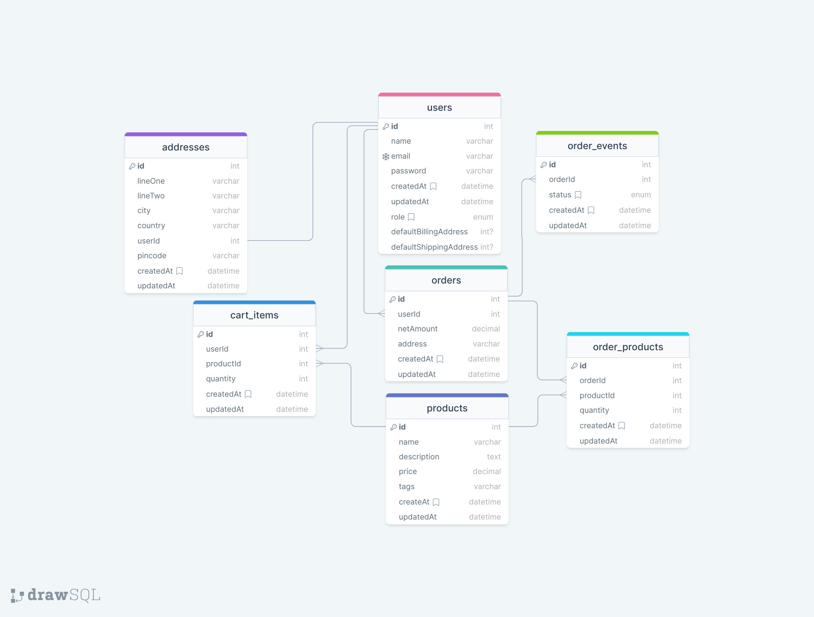

# Ecommerce Api

This simple ecommerce api is made in Express TS Mysql Prisma Orm and JWT

### New to me 🧑‍💻

- Prisma
  * Setup using Mysql.
  * making model, types, Relation, query.
  * Prisma Client.
  * npx prisma migrate dev --name `<name of migration>`
  * npx prisma generate.
  * npx prisma studio.
  * Extends & Transaction.
  
- Zod

  * I'm using zod for schema and validation
   
- Exceptions

  * Creating reusable Custom Error Class.
  
- Github Action

   * Simple github/workflow for build when pull and push      trigger in my repository.
   

## ERD

  

